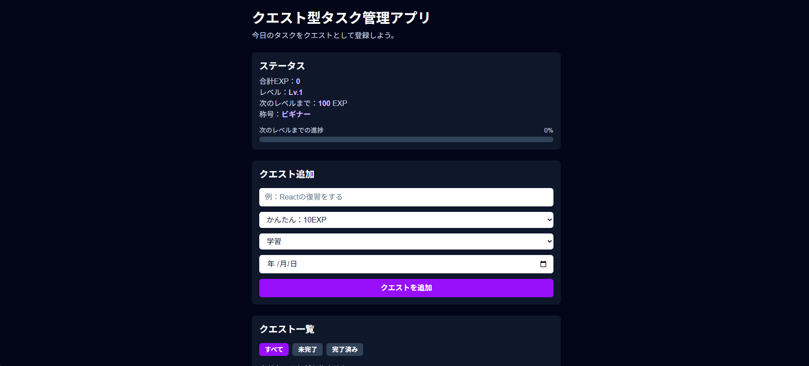

# クエスト型タスク管理アプリ

## 公開URL

https://quest-task-app.vercel.app/

## スクリーンショット



## 概要

タスクをクエストとして登録し、完了することでEXPを獲得できるタスク管理アプリです。
Next.js / TypeScript / React の学習を目的として作成しました。

## 主な機能

- クエスト追加
- クエスト削除
- 完了 / 未完了切り替え
- 難易度設定
- カテゴリ設定
- 期限設定
- 期限切れ表示
- タイトル / 難易度 / カテゴリ / 期限の編集
- LocalStorage保存
- すべて / 未完了 / 完了済みの絞り込み
- 合計EXP表示
- レベル表示
- 称号表示
- 次のレベルまでの進捗バー
- Enterキーでクエスト追加

## 使用技術

- Next.js
- TypeScript
- React
- Tailwind CSS
- LocalStorage

## 学習したこと

- useStateによる状態管理
- useEffectによるLocalStorage保存
- map / filter / reduceを使った配列操作
- TypeScriptの型定義
- 条件による表示切り替え
- 編集状態の管理
- 期限切れ判定

## 今後追加したい機能

- コンポーネント分割
- スマホ表示の改善
- DB保存
- ログイン機能

## コンポーネント構成

現在、以下のようにコンポーネントを分割しています。

```txt
app/
  page.tsx

components/
  QuestForm.tsx
  QuestFilter.tsx
  QuestItem.tsx
  StatusCard.tsx
  FocusTimer.tsx
```

## 追加機能：Focus Quest

クエストに集中タイマー機能を追加しました。

- 25分 / 50分 / 60分の集中タイマー
- 5分 / 10分の休憩タイマー
- 開始 / 一時停止 / リセット
- 未完了クエストを選択して集中
- タイマー完了時にクエストへ集中時間を加算
- 集中時間をEXPに反映
- 合計集中時間の表示
